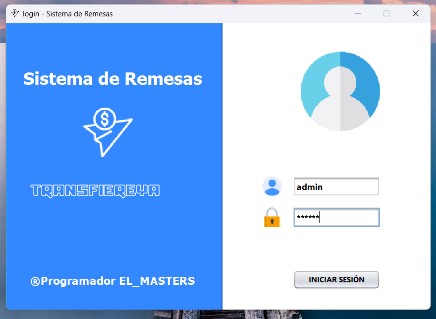
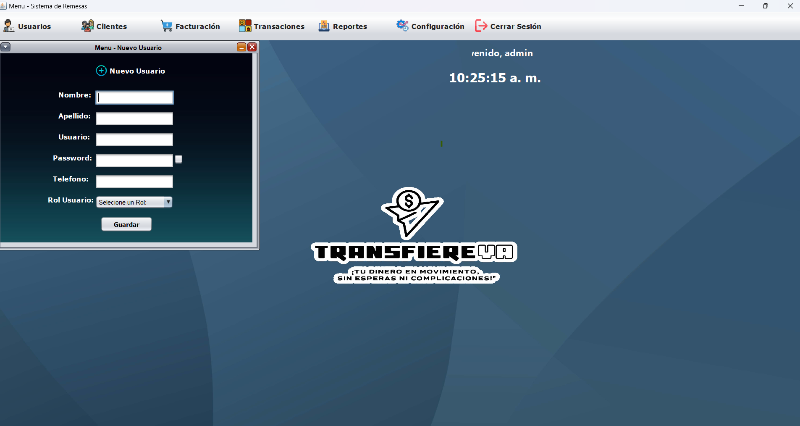
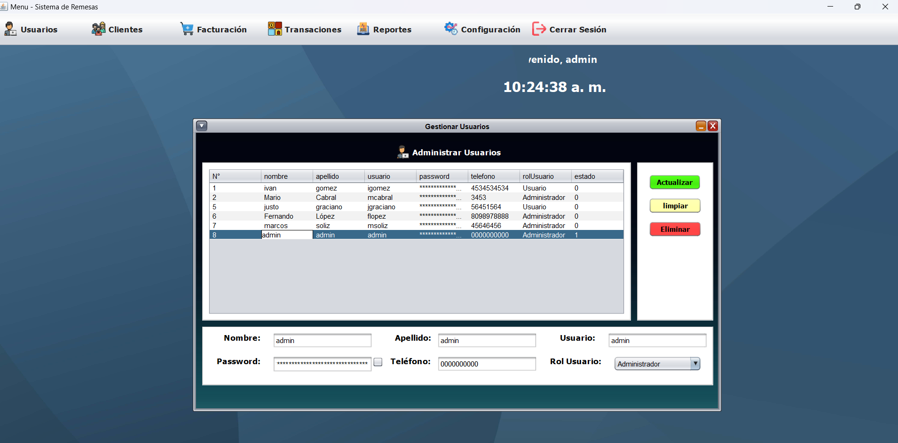
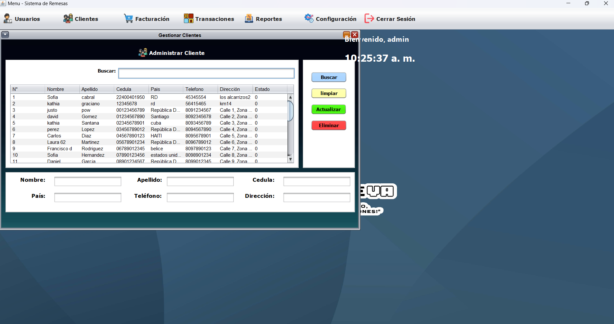
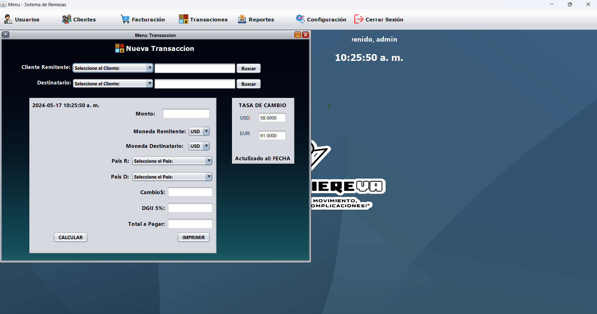
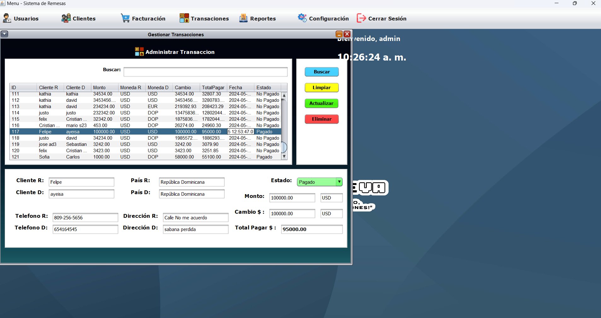
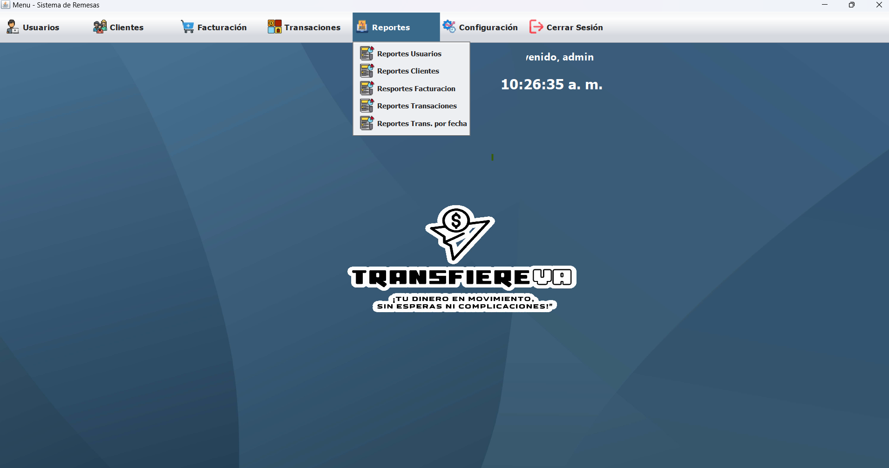
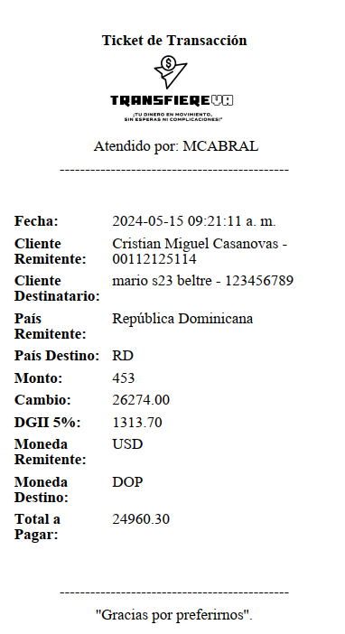
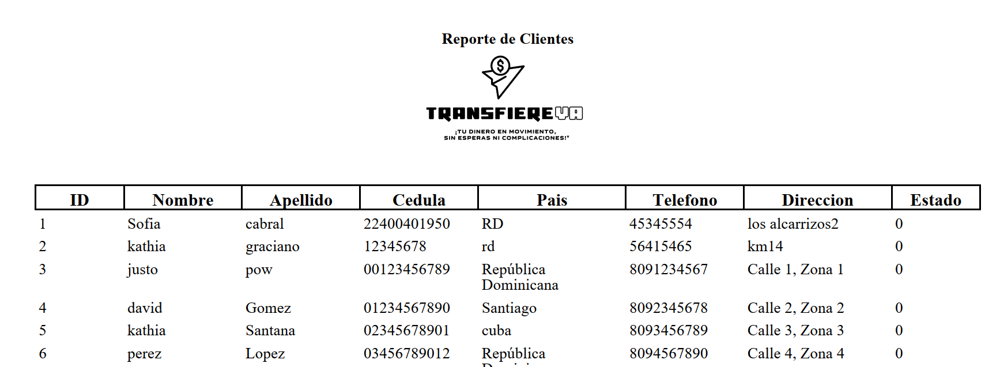

# Transfiereya - Sistema de Remesas

Transfiereya es una aplicación de escritorio diseñada para facilitar el envío de remesas de manera segura y eficiente. Este sistema permite a los usuarios registrar y gestionar envíos de dinero, así como administrar información de clientes y transacciones.

## Características

- Registro y autenticación de usuarios.
- Registro de clientes.
- Envío y recepción de remesas.
- Gestión de Usuarios.
- Gestión de clientes.
- Historial de transacciones.(futuro)
- Generación de informes.
- Seguridad mejorada con hashing de contraseñas y salts.

## Tecnologías Utilizadas

- Java SE
- MySQL
- JDBC
- Swing (Java GUI)
- Ant
- Librerias Itext pdf y jcalender

## Capturas de Pantalla

### Pantalla de Inicio de Sesión


### Registro de Usuario


### Panel de Administración Usuarios


### Registro de Clientes


### Panel de Administración Usuarios


### Registro de Transacciones


### Panel de Administración Transaciones



### Menu Reportes 


### Reporte ticket


### Reporte Cliente



## Estructura del Proyecto

El proyecto sigue una arquitectura MVC (Modelo-Vista-Controlador) para una mejor organización y mantenibilidad.

## Profesor 
Julio Castro Uasd

## Estudiante
Mario Cabral - EL_MASTERS


## Instalación y Configuración

### Requisitos

- Java JDK 11 o superior
- MySQL Server


### Configuración

1. Clona el repositorio:
    ```sh
    git clone https://github.com/ELMASTERS/Transfiereya.git
    cd Transfiereya
    ```

2. Configura la base de datos MySQL:
    - Crea una base de datos llamada `transfiereya`.
    - Importa el esquema y los datos iniciales desde el archivo `backup.sql` incluido en el repositorio en la carpeta `base de datos`.

3. Configura la conexión a la base de datos en `src/conexion/Conexion.java`:
    ```java
    public class Conexion {
        // Ajusta estos valores según tu configuración de MySQL
        Connection cn = DriverManager.getConnection("jdbc:mysql://localhost:3307/bd_transfiereya?autoReconnect=true&useSSL=false", "root", "123456");
    }
    ```

4. Compila y ejecuta la aplicación usando apache netbeant.
   

## Contribuir

¡Las contribuciones son bienvenidas! Si tienes sugerencias, problemas o mejoras, por favor abre un issue o un pull request.

## Licencia

Este proyecto está licenciado bajo la Licencia MIT. Para más detalles, consulta el archivo [LICENSE](LICENSE).

## Contacto

Para más información o preguntas, puedes contactarme a través de:
- Correo: marolo911@gmail.com
- GitHub: [ELMASTERS](https://github.com/ELMASTERS)
- by EL_MASTRERS